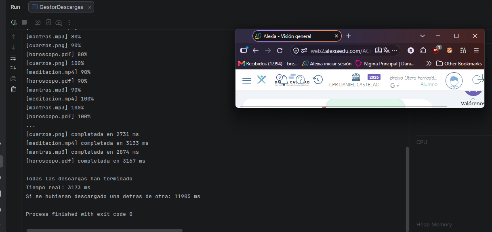
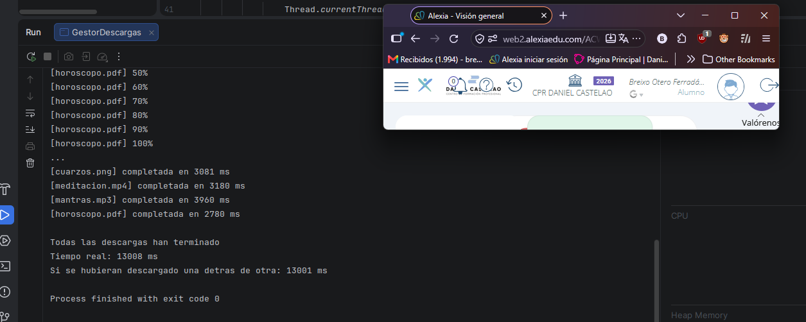
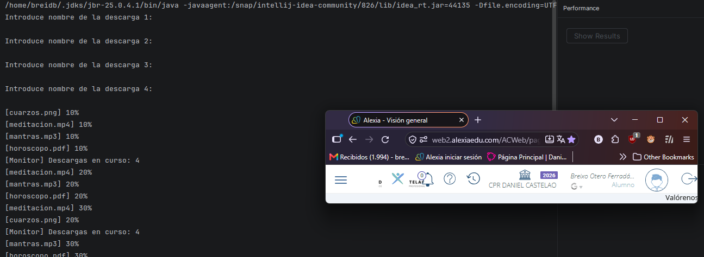
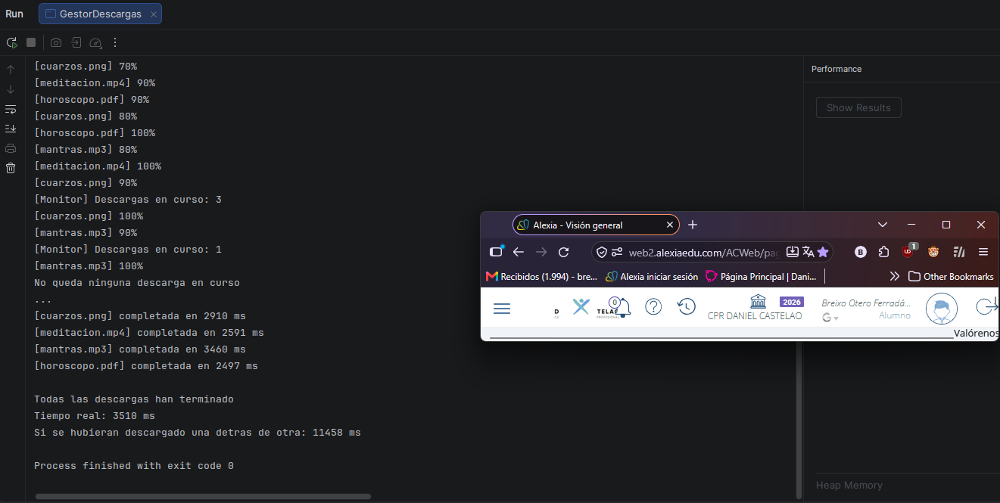
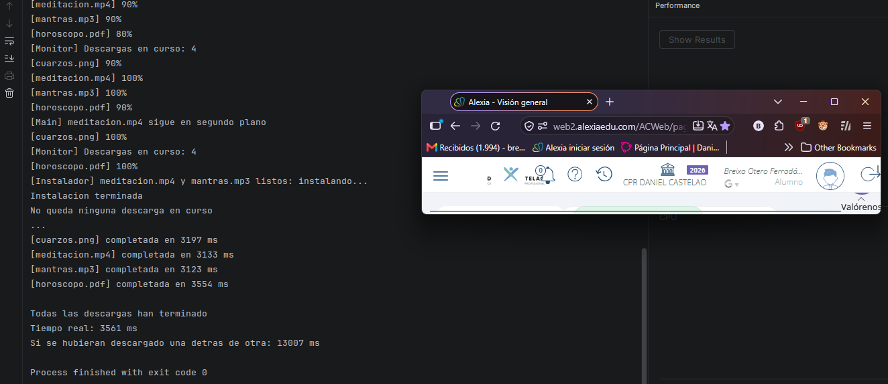
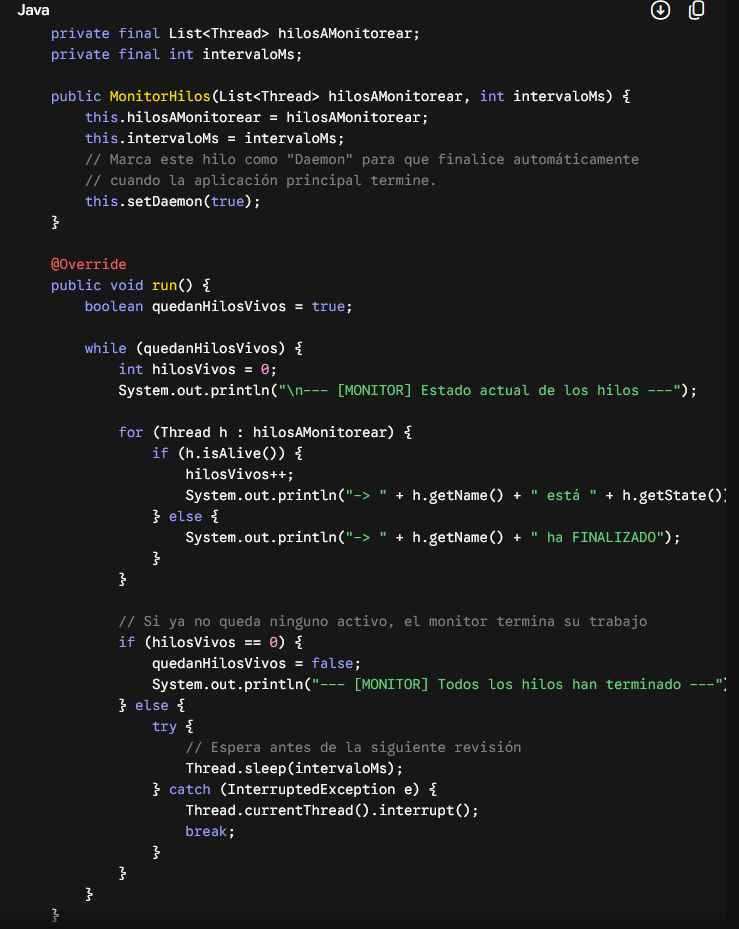
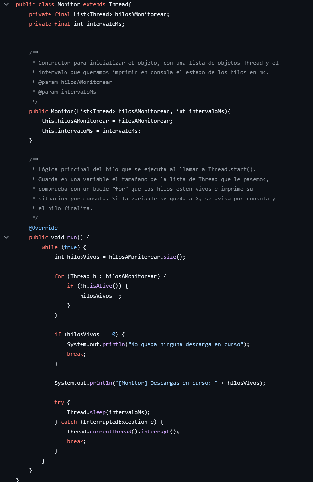

# Tarea 09 - Hilos

## Niveles realizados: 1, 2

## Nivel 1

| Ejecución | Descarga mas lenta | Tiempo real (ms) | Suma(ms) |
| ---------- | ---------- | ---------- | ---------- |
| 1 | 3167 ms | 3173 ms | 11905 ms |
| 2 | 3464 ms | 3481 ms | 13301 ms |
| 3 | 4116 ms | 4127 ms | 13555 ms |

### ¿Por qué el tiempo real es mucho menor que la suma?
Porque en la suma se supone que utilizaría un solo hilo para hacer las descargas una detras de otra, y en 
el tiempo real se usan 4 hilos independientes para gestionar cada descarga, por lo que es mucho mas eficiente
al realizarse en paralelo.

### ¿Qué pasa si hacéis start() y join() dentro del mismo bucle? Probadlo y poned el tiempo real que os sale.

El programa ejecuta los hilos de forma totalmente secuencial, por lo que destruye la concurrencia y 
el tiempo real se aproxima a la suma, de hecho la supera ligeramente debido a la sobrecarga del sistema
que no queda registrada dentro de la medición interna de cada hilo.

## Nivel 2

## Nivel 3

## Declaracion de uso de IA
### Modelo: Gemini
### Clase Monitor Nivel 2

Donde mas la use fue a la hora de plantear el nivel 2, ya que tenia que utilizar la herencia de Thread
y no sabia muy bien como hacerlo. Utilicé como plantilla lo que me dio para hacer lo que queria exactamente.

### Otros usos
Le pregunte otras cosas mas menores que no me acordaban del curso pasado de Java, como el como hacer para generar
un numero aleatorio para el primer nivel de domir los hilos
